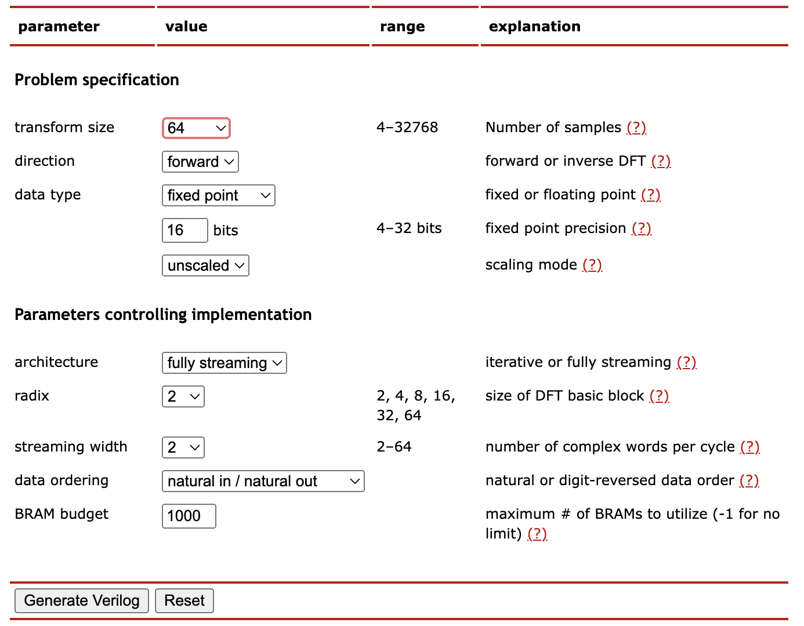
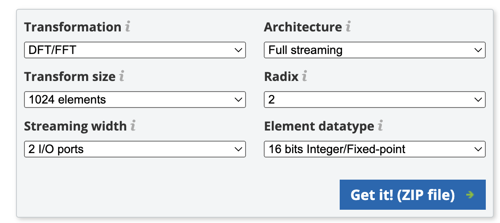
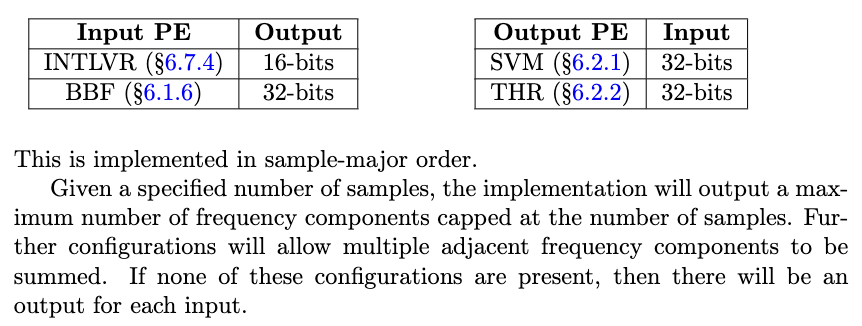
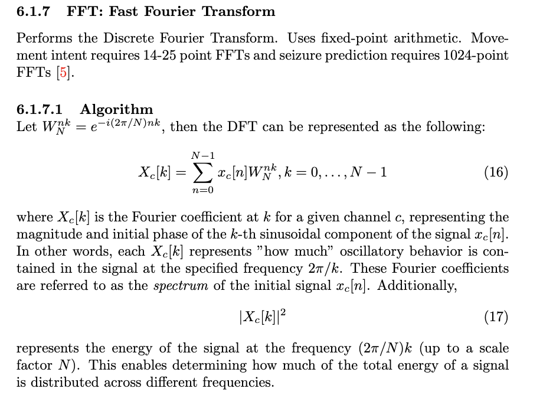
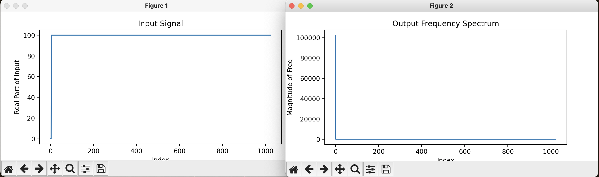
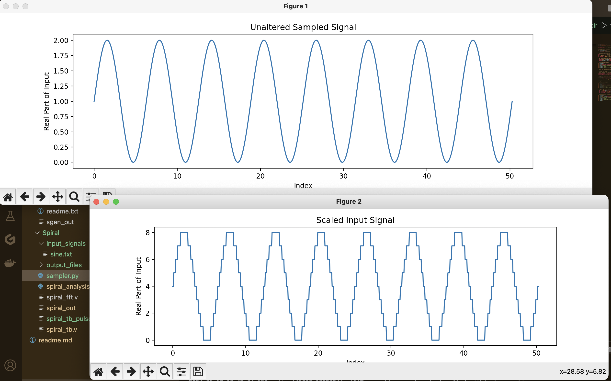
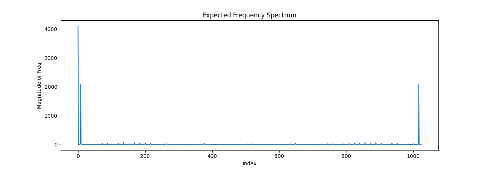
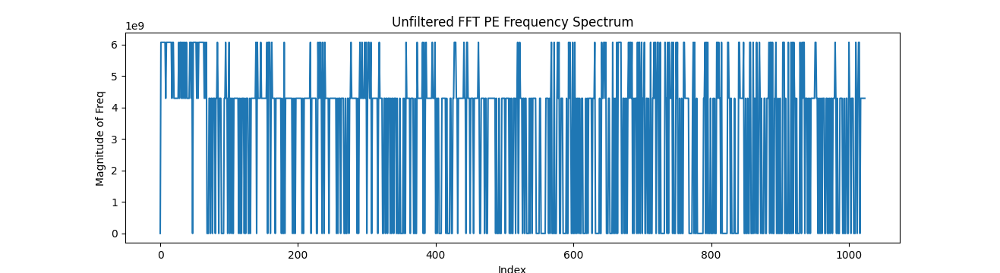
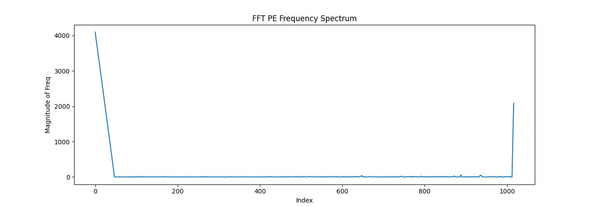

# FFT Processing Element Analysis

I am going to try to keep track of decisions made and why here.

## I. Problem Analysis

### Choosing a FFT hardware generator

I came across two main hardware FFT generators, with many smaller projects as well.

1. [SGen, ETH Zürich](https://acl.inf.ethz.ch/research/hardware/)
2. [Spiral, CMU](https://www.spiral.net/hardware/dftgen.html)

The Spiral implementation seems to be very focussed on creating a highly optimized FFT implementation, so seems better at first glance. I am going to generate with both and compare the results. Furthermore, Spiral seems more configurable.

*Is sparse FFT relevant (sparse frequency domain)? [SFFT v3](https://www.spiral.net/software/sfft.html)*

*Spiral Interface*
 

*SGen Interface*



### Constraints 

This is mostly from reading the [SCALO paper](https://mckarthik7.github.io/pdfs/ksriram_scalo.pdf).

- Clock = 15.7 MHz

- DFT size = 1024 
    - adjustable for different applications (ie movement intent needs 14-25)
    - going to implement 1024 for first implementation, before making it adjustable

- ~46 Mbps data rate

- Power
    - ~1mW of power from HALO graphs
    - 9.02 µW dynamic and 141µW leakage from SCALO 
    - Will check after access to grace cluster.

- Data type
    - fixed point
    - need to check about interleaver, but going with upper bound of 32 bit for now
    - 

- Algorithm description
    - 


## II. FFT PE Generation

### Parameters
- **Transform Size**: 1024 (adjustable for different applications, but start with 1024)
- **Direction**: Forward
- **Data Type**: Fixed Point
- **Bits**: 32 bits (upper bound for fixed point)
- **Scaling Mode**: Unscaled (don't think scaling is necessary, but <u>check later</u>)
- **Architecture**: Fully Streaming (to maximize throughput)
- **Radix**: 4 (higher radices more efficient for large DFT, but concerned about resource usage sow will start with 4)
- **Streaming Width**: 4 (again, dependent on available resources and power constraints, will start with 4 ∵ limited by radix)
- **Data Ordering**: Natural In / Natural Out
- **BRAM Budget**: 1000 (unsure how much available, <u>need to check</u>)

<br>

Output: 
- **Input/output stream**: 4 complex words per cycle
- **Throughput**: one transform every 256 cycles
- **Latency**: 777 cycles

Verilog files, slightly altered so that I can test them easier: [./Iteration-1/Spiral/](./Iteration-1/Spiral/)

### Spiral Testbench

I have created a custom testbench for the spiral generated FFT which allows me to alter the input for testing ([./Iteration-1/Spiral/spiral_tb.v](./Iteration-1/Spiral/spiral_tb.v)).

Use iverilog to compile the testbench:

`iverilog -o spiral_out spiral_tb.v spiral_fft.v`

Then run using vvp:

`vvp spiral_out`

### Spiral Analysis

I also created a python script to analyze the dumped output from the testbench ([./Iteration-1/Spiral/spiral_analysis.py](./Iteration-1/Spiral/spiral_analysis.py)).

For an initial example I went for the most basic input signal that I knew the output frequency spectrum for. I created a signal of constant value, and the output for that should be a single peak at DC frequency (ie index = 0). And the output was as expected, shown below.



## III. Generalization Interlude

### Sampler

At this point I think a system for sampling any arbitrary signal so that I can test the FFT PE (in a way that works with verilog) is necessary. This is slightly tricky as verilog is not very good with signals or sampling (ie using a sine wave as an input would require me to create an LUT which seems unecessary).

I made a quick script that generates samples from your chosen signal: [./Iteration-1/Spiral/sampler.py](./Iteration-1/Spiral/sampler.py). The script samples the specified signal, then further scales it so that it is of a reasonable size in the 32-bit fixed point representation.

The first signal I decided to sample was a sine wave, and the output from the sampler.py script is shown below.

*Note: the function being sampled is $sin(x) + 1$ to ensure all values ≥ 0*

.

The script also shows the ideal output of an FFT applied to the signal. An example of a sine wave's FFT output is shown below.



### Generalized Testbench

[./Iteration-1/Spiral/spiral_tb_general.v](./Iteration-1/Spiral/spiral_tb_general.v) is the generalised testbench for any sampled input. There are a lot of intermediary text files that are read/written to, and I will later make all of that automated as well. 

The output of the testbench is written in a custom format, and then analysed using the spiral analysis script.

### Analysis of FFT Output

To analyse the outputs, I made  a python script provides graphs that show the input into the FFT PE, as well as the output frequency spectrum. The unaltered output from the FFT PE seems to suffer from a lot of noise, I think mostly caused by over/underflows. So, I created a filter to remove the likely noise-impacted data and got a reasonable output. This filter could likely use some fine tuning to get the best possible result - perhaps this is even irrelevant for brain signal processing.

Example unfiltered and filtered outputs:





*this needs a bit more work*

### How to run

To do the steps above, run the following commands, making sure that you change the function being sampled/directories if needed.

Currently it will sample $sin(x) + 1$ and run the FFT on that. If you change the `sample_func(x)` in [./Iteration-1/Spiral/sampler.py](./Iteration-1/Spiral/sampler.py) to another function, you can sample that instead, no changing of directories needed. You may want to change the filter cutoffs.


to run:
```
cd ./Iteration-1/Spiral/
```
Then
```
python sampler.py
iverilog -o spiral_out spiralr_tb_general.v spiral_fft.v
vvp spiral_out
python spiral_analysis.py
```

Can also run using the bash script:
```
./run_simulation.sh
```


# Other stuff need to write up
note: spiral code much more readable than SGen.

- noise filtering

- the fft is so so sensitive, show example of adding some 0s to start of input.

- generalised testbench

- noise reduction

- input data clipping

- talk about sampler

also add other learning resources

Also look at prev analysis doc: [Old analysis doc](./FFT-Spiral-HALO/readme.md)

- one of the interesting takeaways:

    """ <br>
    *Started with changing to 1024 DFT size, keeping making I/O stream 2 complex words per cycle, to reduce dynamic power consumption (at cost of speed, as it seems like data throughput is not a bottleneck here, but power might end up being).*

    *DFT Size = 1024 <br>*
    *Direction = forward <br>*
    *Data type = 16 bit fixed point, unscaled <br>*
    *Architecture = fully streaming <br>*
    *Radix = 2 <br>*
    *Streaming width = 2 <br>*
    *Data ordering = natural input / natural output <br>*
    *BRAM budget = -1*

    *Input/output stream: 2 complex words per cycle* <br>
    *Throughput: one transform every 512 cycles* <br>
    *Latency: 1373 cycles*

    *this is still a **1.0048 Gbps** data rate, maybe downlocking or even using less hardware, iterative approach is possible?* <br>
    """

- will need to use grace cluster to check power consumption properly.

